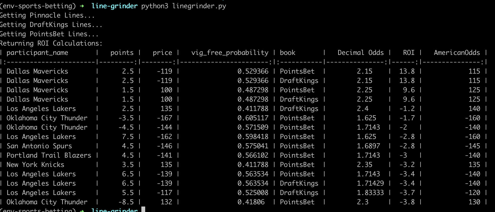

# Line Grinder

A reductive mental model of the sportsbetting industry is this: there are two kinds of sports books - market makers and retail books. The market makers, like [Pinnacle](https://www.pinnacle.com/en/), have accurate lines and the lines from retail books are mostly right but occasionally wrong.

A simple but profitable sports betting strategy is to look for retail lines that differ from market maker lines and bet into them. In the 80's, bookies offered basically only a single point spread per game. Now, the competition for market share has spurred the retail books to offer a smorgesborg of betting products: alternate lines, player props, futures, etc. This large attack surface is hard to maintain and it will contain lines that are wrong.

Finding these "off market" lines is essentially a webscraping problem followed by a simple math problem. This module does both for you.

```
python3 linegrinder.py --league NBA
```



The four columns on the left hand side correspond to the market maker lines. The four columns on the right hand side correspond to the retail book lines. The most important column is the last one: ROI.

Return on investment is how much you stand to win, in expectation, from this "off market" line given that the market maker has given us the "true probability."

So, in this first example, the "True" line is Grizzlies -1.5 for +106. This corresponds to a "True" probability of covering of 47.2%. A retail book called PointsBet is offering the same points at +120. And the ROI of taking the Grizzlies -1.5 at PointsBet is 3.8%.

Oh, one more thing. Nothing in here is financial advice. My lawyers want you to know:

> *This program is 100% for entertainment purposes only and does not involve real money betting. If you or someone you know has a gambling problem and wants help, call 1-800-GAMBLER. This service is intended for adult users only.*

#### TODO
    - Add more retail books:
        - FanDuel
        - BetRivers
        - BarStool
        - Wynn
    - Bugfix: The books are not using static identifiers for teams.
    - Increase execution speed
    - Add more leagues
    - Add more markets
        - Game totals
        - Player Props
    - Support in-game betting.
    - Create a front-end application.
