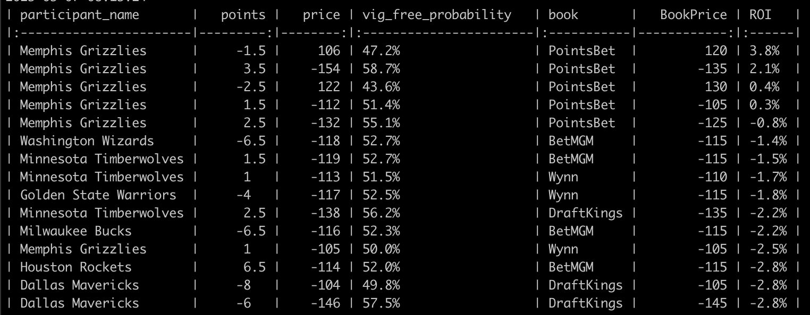

# Line Grinder: Find weak lines, profit.

A reductive mental model of the sportsbetting industry is that there are two kinds of sports books: market makers, and retail books. The market makers take action from all players, including sharp professional sportsbetters, and so their lines are typically very accurate. Retail books are mostly in the business of marketing and their lines can occasionally be wrong.

It follows then that when you find retail book lines that differ from market maker lines, they are wrong. You can take the other side, and profit.

Finding these off lines is essentially a webscraping problem and then a simple math problem. This module does both for you.

```
python3 linegrinder.py
```



The four columns on the left hand side correspond to lines from the market maker book, in this case, we will use Pinnacle. The four columns on the right hand side correspond to the lines from the retail books. The most important column is the last one: ROI.

Return on investment is how much you stand to win, in expectation, from this weak retail book line given that the market maker has given us the "true probability."

In this first example, the "True" line (from Pinnacle) is -119 which corresponds to a 53% probability of covering. PointsBet is offering the same points at +115. So, the estimated ROI for taking the points is 13%.

Oh, one more thing. Nothing in here is financial advice. My lawyers want you to know:

    This program is 100% for entertainment purposes only and does not involve real money betting. If you or someone you know has a gambling problem and wants help, call 1-800-GAMBLER. This service is intended for adult users only.

#### Outstanding Work To Do:
    - Bugfix: exclude retail books from returning in-game lines.
    - Add more retail books: WynnBet, BetMGM, Caesars, FanDuel, BetRivers
    - Paralleize to increase speed
    - Add more leagues: NCAAM
    - Add more sports.
    - Create a non command-line front end.